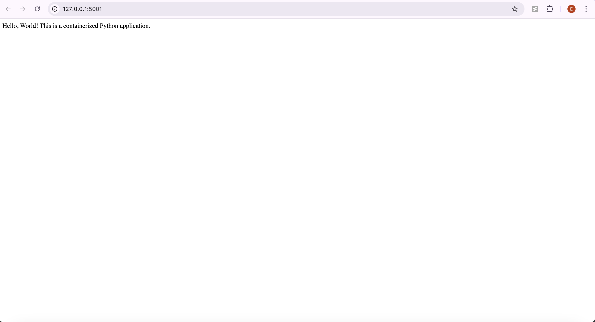

# dockerized_applications
[](https://github.com/aoaow/dockerized_applications/actions/workflows/cicd.yml)

---


## **Project Overview**

This project demonstrates how to create a simple Python web application using Flask, containerize it with Docker, and set up a Continuous Integration and Continuous Deployment (CI/CD) pipeline using GitHub Actions. The Docker image is automatically built and pushed to Docker Hub whenever changes are made to the codebase.



## **Features**

- **Simple Flask Application**: A basic web application that returns a greeting message.
- **Dockerized Environment**: The application runs inside a Docker container for consistent deployment.
- **Automated CI/CD Pipeline**: Uses GitHub Actions to build and push the Docker image to Docker Hub automatically.

## **Prerequisites**

- **Docker**: Install Docker in your local machine.
- **Git**: Install Git for version control.

## **Application Usage**

- **Access Application**: Open your web browser and navigate to http://localhost:5000.
- **Expected Output**: You should see the following message displayed:

```bash
Hello, World! This is a containerized Python application.
```

- **Stop the Container**: To stop the running container, use the following command:

```bash
docker ps          # List running containers to find the CONTAINER ID
docker stop <CONTAINER_ID>
```


## **Contributing**

Contributions are welcome! Please fork the repository and submit a pull request with your changes.

## **License**

This project is licensed under the MIT License.


